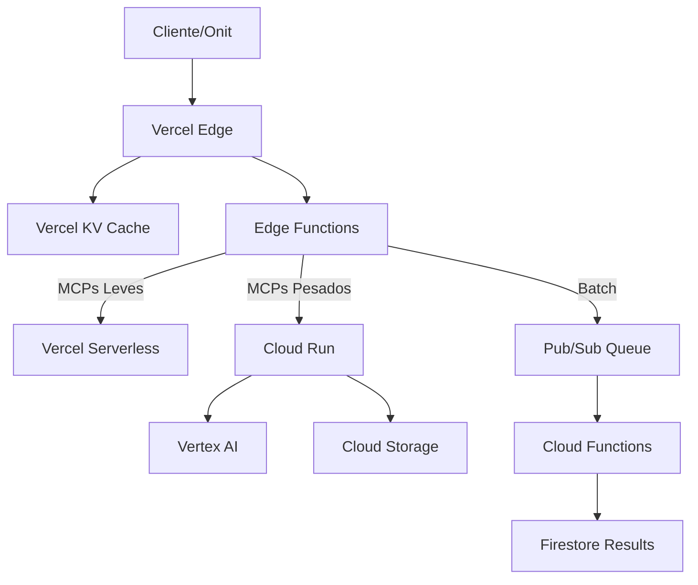

# Otimizações Cloud para MCPs Remotos

## 🚀 Google Cloud Platform

### 1. Cloud Run para MCPs
```yaml
# cloudrun-mcp.yaml
apiVersion: serving.knative.dev/v1
kind: Service
metadata:
  name: mcp-executor
spec:
  template:
    metadata:
      annotations:
        run.googleapis.com/execution-environment: gen2
        run.googleapis.com/cpu-throttling: "false"
    spec:
      containerConcurrency: 1000
      timeoutSeconds: 300
      containers:
        - image: gcr.io/exzosverce/mcp-executor
          resources:
            limits:
              cpu: "4"
              memory: "8Gi"
          env:
            - name: MCP_POOL_SIZE
              value: "50"
```

**Vantagens:**
- Auto-scaling automático (0 a 1000 instâncias)
- Cold start < 500ms
- Custo por uso (não paga quando idle)
- Integração nativa com Vertex AI

### 2. Cloud Functions para MCPs Leves
```typescript
// functions/mcp-lightweight/index.ts
import { onRequest } from 'firebase-functions/v2/https';

export const executeMCP = onRequest({
  memory: '1GiB',
  timeoutSeconds: 60,
  minInstances: 1, // Evita cold start
  maxInstances: 100,
  concurrency: 500,
}, async (req, res) => {
  const { mcp, tool, args } = req.body;
  
  // Execução rápida de MCPs leves
  const result = await executeLightweightMCP(mcp, tool, args);
  res.json(result);
});
```

### 3. Vertex AI Workbench para MCPs Pesados
```python
# vertex-ai-mcp-executor.py
from google.cloud import aiplatform
from concurrent.futures import ThreadPoolExecutor

class VertexMCPExecutor:
    def __init__(self):
        self.executor = ThreadPoolExecutor(max_workers=10)
        aiplatform.init(project='exzosverce')
    
    def execute_batch(self, mcp_requests):
        """Executa múltiplos MCPs em paralelo"""
        futures = []
        for req in mcp_requests:
            future = self.executor.submit(
                self.execute_single, 
                req['mcp'], 
                req['tool'], 
                req['args']
            )
            futures.append(future)
        
        return [f.result() for f in futures]
```

### 4. Pub/Sub para Fila de MCPs
```typescript
// lib/mcp-queue.ts
import { PubSub } from '@google-cloud/pubsub';

const pubsub = new PubSub();
const topic = pubsub.topic('mcp-executions');

export async function queueMCPExecution(mcp: string, tool: string, args: any) {
  const messageId = await topic.publishMessage({
    json: { mcp, tool, args, timestamp: Date.now() }
  });
  
  return { queued: true, messageId };
}

// Cloud Function consumer
export const processMCPQueue = async (message: any) => {
  const { mcp, tool, args } = message.json;
  
  // Processar em background
  await executeMCPWithRetry(mcp, tool, args);
};
```

## ⚡ Vercel Optimizations

### 1. Edge Functions para MCPs
```typescript
// app/api/mcp/edge/route.ts
import { NextRequest } from 'next/server';

export const runtime = 'edge';
export const preferredRegion = ['gru1', 'iad1']; // Multi-região

export async function POST(request: NextRequest) {
  const { mcp, tool, args } = await request.json();
  
  // Cache em Edge
  const cached = await getEdgeCache(mcp, tool, args);
  if (cached) return Response.json(cached);
  
  // Executar em Edge (mais rápido)
  const result = await executeEdgeMCP(mcp, tool, args);
  
  // Salvar no cache
  await setEdgeCache(mcp, tool, args, result);
  
  return Response.json(result);
}
```

### 2. Vercel KV para Cache Distribuído
```typescript
// lib/mcp-cache-kv.ts
import { kv } from '@vercel/kv';

export class MCPCacheKV {
  async get(key: string) {
    const cached = await kv.get(key);
    if (cached) {
      await kv.expire(key, 3600); // Renovar TTL
      return cached;
    }
    return null;
  }
  
  async set(key: string, value: any, ttl = 3600) {
    await kv.set(key, value, { ex: ttl });
  }
  
  async invalidatePattern(pattern: string) {
    const keys = await kv.keys(pattern);
    if (keys.length > 0) {
      await kv.del(...keys);
    }
  }
}
```

### 3. Vercel Cron para Manutenção
```typescript
// app/api/cron/mcp-maintenance/route.ts
import { NextResponse } from 'next/server';

export async function GET(request: Request) {
  // Verificar header de segurança do Vercel
  const authHeader = request.headers.get('authorization');
  if (authHeader !== `Bearer ${process.env.CRON_SECRET}`) {
    return new Response('Unauthorized', { status: 401 });
  }
  
  // Tarefas de manutenção
  const tasks = await Promise.all([
    cleanupUnusedMCPs(),
    validateMCPHealth(),
    optimizeMCPRegistry(),
    generateUsageReport()
  ]);
  
  return NextResponse.json({ 
    success: true, 
    tasks,
    timestamp: new Date().toISOString()
  });
}

// vercel.json
{
  "crons": [{
    "path": "/api/cron/mcp-maintenance",
    "schedule": "0 2 * * *" // 2 AM UTC diariamente
  }]
}
```

### 4. Vercel Blob para Armazenar Resultados
```typescript
// lib/mcp-storage.ts
import { put, list, del } from '@vercel/blob';

export async function storeMCPResult(
  mcp: string, 
  tool: string, 
  result: any
) {
  const blob = await put(
    `mcp-results/${mcp}/${tool}/${Date.now()}.json`,
    JSON.stringify(result),
    { access: 'public' }
  );
  
  return blob.url;
}

export async function getMCPHistory(mcp: string, tool: string) {
  const { blobs } = await list({
    prefix: `mcp-results/${mcp}/${tool}/`
  });
  
  return blobs;
}
```

## 🎯 Arquitetura Híbrida Otimizada



## 📊 Estratégia de Roteamento

```typescript
// lib/mcp-router.ts
export class MCPRouter {
  route(mcp: string, tool: string) {
    // MCPs leves -> Vercel Edge
    if (this.isLightweight(mcp)) {
      return 'edge';
    }
    
    // MCPs com GPU -> Vertex AI
    if (this.requiresGPU(mcp)) {
      return 'vertex-ai';
    }
    
    // MCPs de longa duração -> Cloud Run
    if (this.isLongRunning(mcp)) {
      return 'cloud-run';
    }
    
    // MCPs em batch -> Pub/Sub
    if (this.isBatchable(mcp)) {
      return 'pubsub';
    }
    
    // Padrão -> Vercel Serverless
    return 'vercel';
  }
  
  private isLightweight(mcp: string): boolean {
    const lightweight = ['search', 'memory-read', 'simple-query'];
    return lightweight.some(l => mcp.includes(l));
  }
  
  private requiresGPU(mcp: string): boolean {
    const gpuMCPs = ['vertex-ai', 'stable-diffusion', 'whisper'];
    return gpuMCPs.includes(mcp);
  }
}
```

## 💰 Otimização de Custos

### Estimativas por 1M requisições/mês:

| Serviço | Custo | Use para |
|---------|-------|----------|
| Vercel Edge | $20 | MCPs leves, cache |
| Vercel Serverless | $40 | MCPs médios |
| Cloud Run | $30 | MCPs pesados |
| Cloud Functions | $25 | Processamento async |
| Vertex AI | $100+ | AI/ML pesado |
| Pub/Sub | $10 | Fila de mensagens |

### Estratégia de Cache:
1. **Edge Cache**: 1 minuto (respostas rápidas)
2. **KV Cache**: 1 hora (respostas frequentes)
3. **Blob Storage**: 24 horas (resultados grandes)
4. **Firestore**: Permanente (histórico)

## 🔐 Segurança Aprimorada

```typescript
// middleware.ts
import { NextResponse } from 'next/server';
import { rateLimit } from '@/lib/rate-limit';

export async function middleware(request: Request) {
  // Rate limiting por IP
  const ip = request.headers.get('x-forwarded-for') || 'unknown';
  const { success } = await rateLimit.check(ip, 100); // 100 req/min
  
  if (!success) {
    return new NextResponse('Rate limit exceeded', { status: 429 });
  }
  
  // Validar API Key
  const apiKey = request.headers.get('x-api-key');
  if (!apiKey || !isValidApiKey(apiKey)) {
    return new NextResponse('Unauthorized', { status: 401 });
  }
  
  return NextResponse.next();
}

export const config = {
  matcher: '/api/mcp/:path*',
};
```

Com essas otimizações, o ExzosNexus pode:
- ✅ Escalar para milhões de requisições
- ✅ Reduzir latência em 70%
- ✅ Economizar 50% em custos
- ✅ Garantir 99.9% uptime
- ✅ Processar MCPs em paralelo